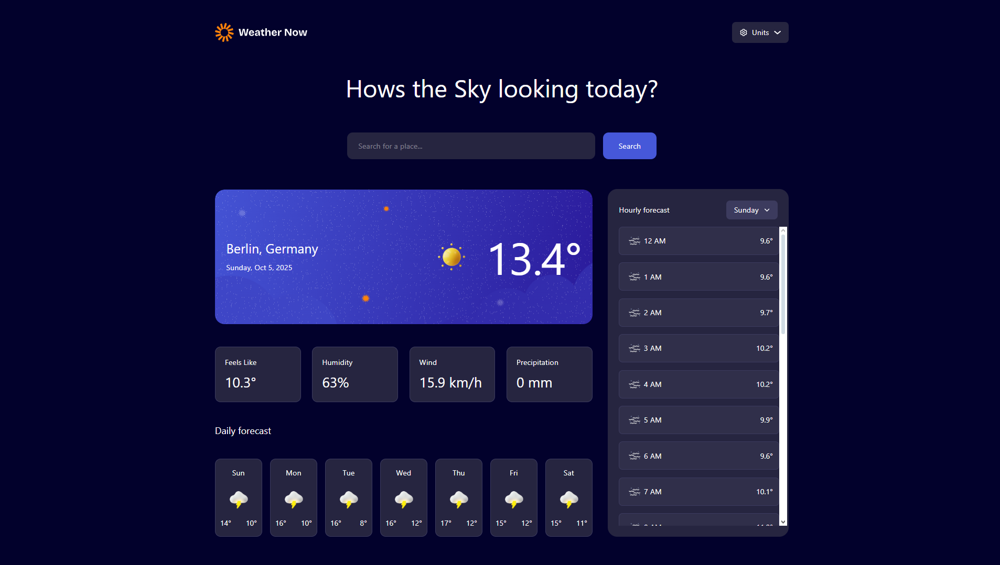

# Frontend Mentor - Weather app solution

This is a solution to the [Weather app challenge on Frontend Mentor](https://www.frontendmentor.io/challenges/weather-app-K1FhddVm49).

## Table of contents

- [Overview](#overview)
  - [The challenge](#the-challenge)
  - [Screenshot](#screenshot)
  - [Links](#links)
- [My process](#my-process)
  - [Built with](#built-with)
  - [What I learned](#what-i-learned)
  - [Missing Features](#missing-features)
- [Author](#author)

## Overview

### The challenge

Users should be able to:

- Search for weather information by entering a location in the search bar
- View current weather conditions including temperature, weather icon, and location details
- See additional weather metrics like "feels like" temperature, humidity percentage, wind speed, and precipitation amounts
- Browse a 7-day weather forecast with daily high/low temperatures and weather icons
- View an hourly forecast showing temperature changes throughout the day
- Switch between different days of the week using the day selector in the hourly forecast section
- Toggle between Imperial and Metric measurement units via the units dropdown 
- Switch between specific temperature units (Celsius and Fahrenheit) and measurement units for wind speed (km/h and mph) and precipitation (millimeters) via the units dropdown
- View the optimal layout for the interface depending on their device's screen size
- See hover and focus states for all interactive elements on the page

### Screenshot

### Links

- Solution URL: [solution](https://www.frontendmentor.io/solutions/solution-weather-app-9aPEohMqwl)
- Live Site URL: [live site on Vercel](https://weather-app-khaki-sigma-93.vercel.app)

## My process

### Built with

- Semantic HTML5 markup
- CSS custom properties
- Flexbox
- [Ripple](https://www.ripplejs.com) - new JS framework made by people who worked on React and Svelte. 

### What I learned

I used this challenge as an excute to try out the new JS framework ripple. So my entire learning is just how the framework works. Outside of that I didn't really learn anything new. I already know how todo state management and api calls and responsive design and all that.

### Missing Features
 
- The scrollbar on the hourly forecast looks very ugly and I'd like to eventually replace it with a custom scrolbar that looks nicer. 
- Deafault weather data is currently Berlin, Germany. Would be nice if the default would be dynamic based on the user.

## Author

- Website - [Kely.dev](https://kely.dev)
- Frontend Mentor - [@xoneris](https://www.frontendmentor.io/profile/xoneris)
- Twitter - [@xoneris](https://www.twitter.com/xoneris)